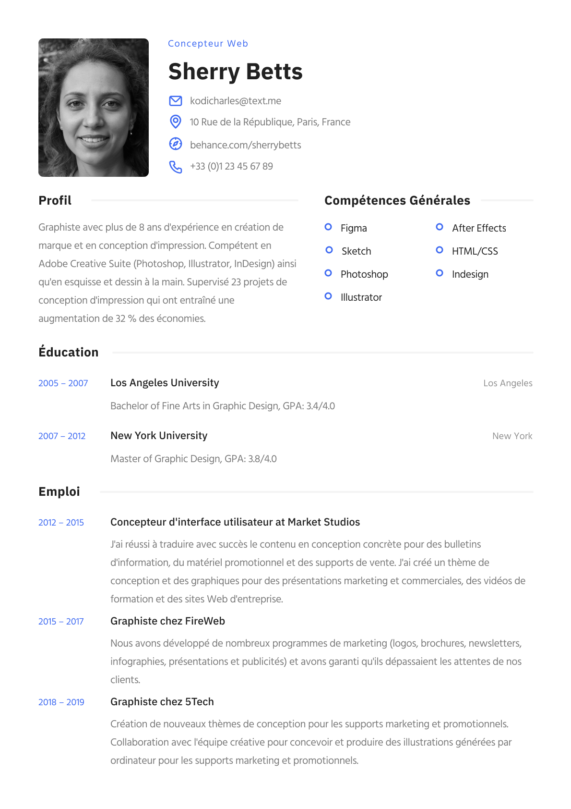

## Assignment 2: Build a Resume Using HTML and CSS

### Task:
1. **Develop a resume** based on the provided example resume image. 
2. You must use only **raw HTML and CSS** to complete this assignment. No JavaScript or external frameworks are allowed.
3. Create a folder under your **existing repository** nameed Week 1 Assignment 2 to store this resume.
4. The folder should be named:
   ```
   Week 1 Assignment 2
   ```

### Submission:
- Share your **GitHub repository link** in **Google Classroom**.
- Click **Done** or **Submit** to submit the assignment.